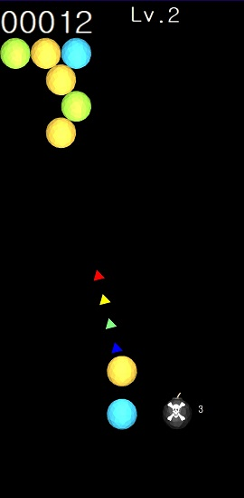

# Bubble
A simple Android game mimicking puzzle bobble.

The goal of this game is to clear all the bubbles in the screen. If identically-colored bubbles form a group of three or more bubbles, they explode and disappear. When the group of bubbles explode, other bubbles hanging from the group will also fall down and be removed.

Development environment is as follows
- Android Studio Chipmunk | 2021.2.1 Patch 1
- Kotlin
- OpenGL ES 3.0
- Blender 2.93

